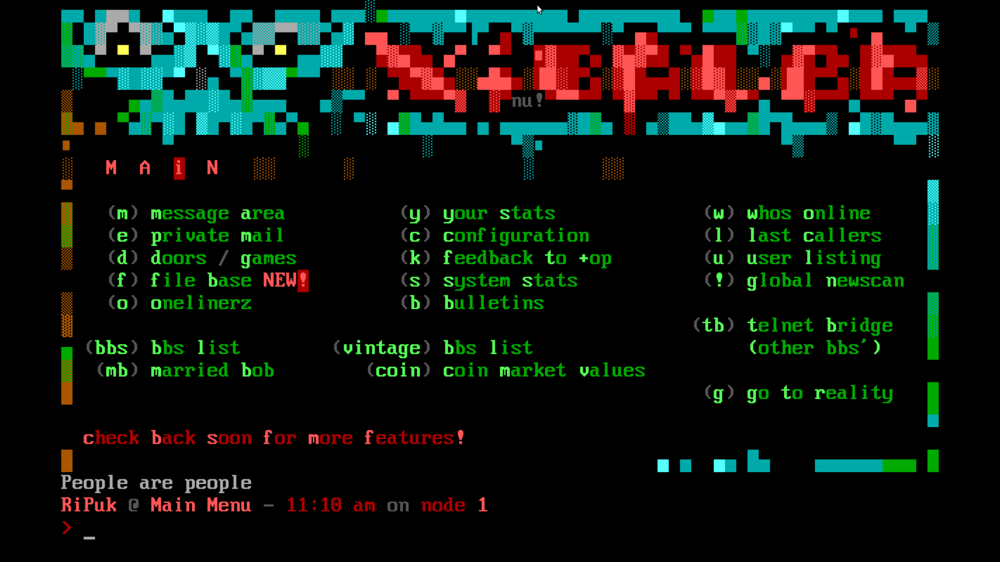

# فصل ۱: آغاز دیجیتال — دوران طلایی ‏BBS

> "جهانی جدید، بدون جاده‌های کهنه"

هر داستانی یک آغاز دارد، و داستان اینترنت از جایی شروع شد که انسان‌ها اولین بار آرزوی ارتباط بر فراز مرزها را داشتند. در دهه ۱۹۷۰ و ۱۹۸۰، زمانی که کامپیوترها به‌تازگی وارد منازل عده‌ای معدود شده بودند، انجمن‌های **BBS‏‎ (Bulletin Board System)** پایگاهی نوین ساختند؛ شبکه‌ای که مانند تابلوی اعلانات دیجیتال عمل می‌کرد.

‏BBS‌ها مرحله‌ای ابتدایی و البته هیجان‌انگیز از اینترنت بودند، چراکه اینترنتی به مفهومی که امروز می‌شناسیم هنوز وجود نداشت، و ارتباطات به خطوط تلفن محدود شده بودند. اما این سیستم‌ها، علی‌رغم محدودیت‌هایشان، اولین تجربه انسانی از جامعه‌های دیجیتالی را ساختند؛ جایی که افراد می‌توانستند پیام بگذارند، اطلاعات منتشر کنند یا بحث‌های گروهی انجام دهند.

---

## تولد ‏BBS

در سال ۱۹۷۸، اولین ‏BBS با نام **CBBS‏‎ (Computerized Bulletin Board System)** توسط *رندی سوئس‌ارت* و *وارد کریستنسن* در شیکاگو راه‌اندازی شد. این ایده از ترکیب شیفتگی آنان به تکنولوژی و طوفان برفی وحشتناکی که آنان را در خانه حبس کرد شکل گرفت.  
آن‌ها یک سیستم ایجاد کردند که کاربران می‌توانستند با شماره‌گیری خط مشخصی به کامپیوترشان متصل شوند و پیام‌هایی بگذارند یا پیام‌های دیگران را بخوانند.

در این سیستم ابتدایی، محدودیت‌های زیادی وجود داشت:  
- هر بار فقط یک کاربر می‌توانست به سیستم متصل شود  
- سرعت انتقال داده ناچیز بود  
- رابط کاربر تنها شامل متن بود  

اما همین سیستم یک جرقه بزرگ محسوب می‌شد. کاربران می‌توانستند با دوستان و غریبه‌ها بدون ملاقات حضوری ارتباط برقرار کنند و این، اولین قدم به سوی عصر دیجیتال بود.

---




## چرا ‏BBS مهم بود؟

با ظهور ‏BBS‌ها، نوعی فرهنگ آوانگارد دیجیتال ایجاد شد:

- **ارتباط اجتماعی:** در زمانی که هیچ شبکه اجتماعی وجود نداشت، ‏BBS‌ها مرکزی برای برقراری ارتباط و یافتن جامعه‌های هم‌فکر بودند.  
- **اشتراک‌گذاری اطلاعات:** کاربران می‌توانستند نکات فنی، داده‌ها و حتی نرم‌افزارها را (به‌صورت محدود و اولیه) بین یکدیگر رد و بدل کنند.  
- **اولین پرسوناهای آنلاین:** بسیاری از کاربران نام‌های مستعاری برمی‌گزیدند که پایه‌های هویت دیجیتالی امروز را بنا نهاد.

---

## محدودیت‌های زمانه

ایده راه‌اندازی یک ‏BBS در دهه ۸۰ آسان نبود. دسترسی به تجهیزات مورد نیاز محدود بود. برای اتصال به یک ‏BBS، شما به:
- یک کامپیوتر  
- یک مودم  
- یک خط تلفن  

نیاز داشتید. سرعت همان مودم‌ها چیزی حدود **۳۰۰ بیت بر ثانیه** بود؛ که با استانداردهای امروز عملاً هیچ محسوب می‌شود.

این محدودیت‌ها باعث شد جوامع کوچک، صمیمی و مبتکرانه‌ای شکل بگیرند. افراد بیشتر بر محتوای گفتگو و ارتباط تمرکز داشتند و برخلاف اینترنت مدرن که غرق در سرعت است، در ‏BBS‌ها زمان کند حرکت می‌کرد؛ همین کندی به تعاملات کاربران عمق می‌بخشید.

---

## اولین جوامع دیجیتال

با پیشرفت ‏BBS‌ها، تم‌های مختلفی شکل گرفت. از بحث‌های علمی، تا فضاهایی برای گیمرهای اولیه یا علاقه‌مندان موسیقی و فیلم.  
این سیستم‌ها، اولین جوامع دیجیتال واقعی جهان را ساختند. برای کسانی که در زمانی زندگی می‌کردند که دسترسی به دنیای بیرون محدود بود، ‏BBS حکم دریچه‌ای به جهانی نامحدود داشت.

---

## تکنولوژی پشت BBSها

زبان‌های برنامه‌نویسی رایج برای ساخت ‏BBSها معمولاً **BASIC**، **C** و گاهی اسمبلی بودند. نرم‌افزارهایی مانند **Fidonet**، **WWIV** و **Renegade** امکاناتی همچون ارسال پیام خصوصی، گروه‌های بحث و اشتراک فایل داشتند.  
ارتباط‌ها از طریق مودم‌های آنالوگ و خطوط تلفن شهری برقرار می‌شد و هر کاربر با شماره‌گیری، به یک کامپیوتر میزبان که اغلب در خانهٔ SysOp قرار داشت وصل می‌شد.

---

## نقش مدیران سیستم (SysOps)

مدیران سیستم یا SysOps:
- سخت‌افزار و نرم‌افزار را نصب و نگه‌داری می‌کردند  
- قوانین جامعه را تنظیم و اجرا می‌کردند  
- ویژگی‌های جدید را کدنویسی می‌کردند  
شخصیت و دیدگاه یک SysOp، شکل و حال‌وهوای جامعهٔ BBS را تعیین می‌کرد.

---

## اقتصاد و فرهنگ پیرامون BBS

برخی BBSها رایگان بودند، اما تعدادی هم برای عضویت هزینه دریافت می‌کردند. این مدل‌های اقتصادی، نخستین نمونه‌های اشتراک دیجیتال را شکل دادند.  
فرهنگی خاص نیز پیرامون BBSها شکل گرفت: اصطلاحات مشترک، شوخی‌های داخلی، رقابت دوستانه برای جذب کاربران، و حتی رویدادهای حضوری بین اعضا.

---

## هک و امنیت در دوران BBS

هکرهای اولیه گاهی سعی می‌کردند وارد بخش‌های محدود BBS شوند. این تلاش‌ها باعث شد ابزارهای شناسایی و جلوگیری از نفوذ پدید آید، که به‌عنوان نخستین جرقه‌های امنیت دیجیتال شناخته می‌شوند.

---

## هنر ASCII و هویت بصری

در غیاب رابط گرافیکی، BBSها از **هنر ASCII** برای تزئین صفحات بهره می‌بردند. لوگوها و بنرهای ساخته‌شده از کاراکترهای متنی، حکم هویت بصری هر BBS را داشت.


---

### نمونهٔ هنر ASCII
```text
   ______  ____   ____   _____
  / ____/ / __ \ / __ \ / ___/
 / /__   / / / // / / / \__ \ 
 \___ \ / /_/ // /_/ / ___/ / 
____/ / \____/ \____/ /____/  
/____/
   The Digital Bulletin Board
```

## شبکه‌های زنجیره‌ای BBS

با نرم‌افزارهایی چون **Fidonet**، BBSها می‌توانستند به یکدیگر متصل شوند و پیام‌ها را به‌صورت دوره‌ای همگام کنند. این ویژگی، ارتباطات فرامکانی را ایجاد کرد، البته با تأخیر یک یا چند روزه.

---

## میراث ‏BBS

‏BBS آغازگر بسیاری از مفاهیمی بود که امروز می‌شناسیم: از انجمن‌های گفت‌وگو (**Forums**) تا تالارهای مدرن مانند **Reddit**. اصول اولیه BBS، مانند بحث گروهی و تعامل ناشناسان، هنوز در اینترنت باقی است.  
با ظهور وب جهانی در دهه ۹۰، BBSها آرام‌آرام محو شدند، اما میراثشان—ارتباط انسانی در فضای دیجیتال—همچنان زنده است.
